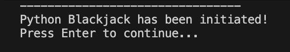
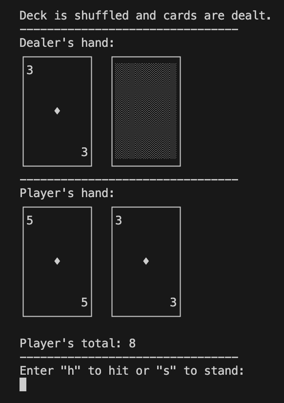
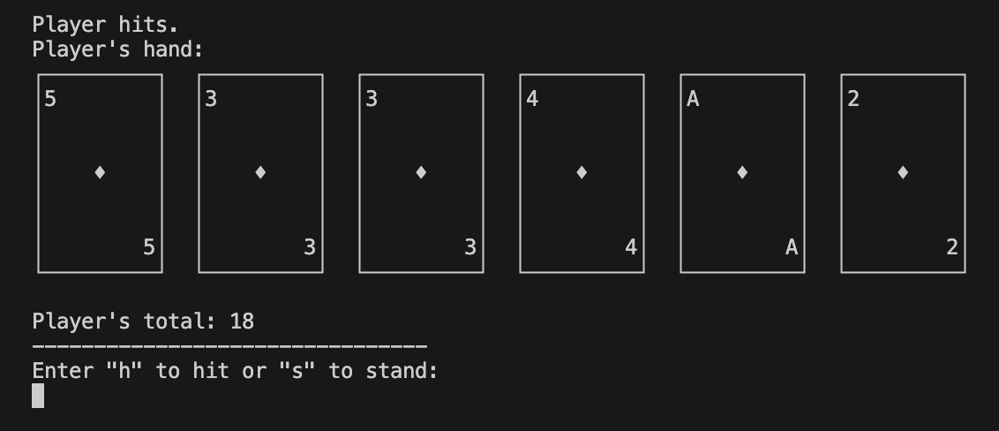
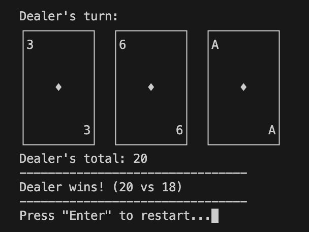

# Python Blackjack

A console-based **Blackjack** game implemented in Python.
<br><br>


---

## Table of Contents

1. [Features](#features)  
2. [Code Snippets](#code-snippets)
3. [Installation](#installation)  
4. [Usage](#usage)  
5. [Gameplay Rules](#gameplay-rules)  
6. [Screenshots](#screenshots)  

---

## Features

- Play Blackjack in the console with a shuffled deck.
- Dealer and player logic, including automatic dealer turn.
- Detects Blackjack and busts automatically.
- ASCII art for cards for a visually appealing experience.
- Handles player choices to **hit** or **stand**.
- Continuous gameplay loop until the player exits.

---

## Code Snippets

Some key code snippets from the project, demonstrating core functionalities:

<details><summary>Starting a Game Round</summary>

```python
def game_start():
    reset_deck()
    """Start a round of Blackjack."""
    random.shuffle(deck)
    hands['player'] = [deck.pop(), deck.pop()]
    hands['dealer'] = [deck.pop(), deck.pop()]

    clear_screen()
    print('Deck is shuffled and cards are dealt.')
    print('--------------------------------')

    # Show initial hands
    print("Dealer's hand:")
    print_dealer_cards(hands['dealer'][0], hide_second=True)
    print('--------------------------------')
    print("Player's hand:")
    print_cards_side_by_side(hands['player'])
    print(f"\nPlayer's total: {hand_value(hands['player'])}")
    print('--------------------------------')

    # Check for immediate blackjack
    player_total = hand_value(hands['player'])
    dealer_total = hand_value(hands['dealer'])

    if player_total == 21:
        print("Player has blackjack!")
        if dealer_total == 21:
            print("Dealer also has blackjack! It's a tie!")
        else:
            print("Player wins with blackjack!")
        input('Press "Enter" to restart...')
        clear_screen()
        game_start()
        return
    if dealer_total == 21:
        print("Dealer has blackjack!")
        input('Press "Enter" to restart...')
        clear_screen()
        game_start()
        return

    player_hit()
```
</details>

<details><summary>Resetting the deck</summary>

```python
def reset_deck():
    global deck
    values = [2, 3, 4, 5, 6, 7, 8, 9, 10, 11]
    deck = []
    for value in values:
        for _ in range(4):
            if value == 10:
                display = random.choice(['10', 'J', 'Q', 'K'])
            elif value == 11:
                display = 'A'
            else:
                display = str(value)
            deck.append((value, display))
    random.shuffle(deck)
```
</details>

<details><summary>Drawing Cards</summary>

```python
def display_card_lines(card):
    """Return card as a list of strings for printing."""
    value, card_str = card
    return [
        "┌─────────┐",
        f"│{card_str:<2}       │",
        "│         │",
        "│         │",
        "│    ♦    │",
        "│         │",
        "│         │",
        f"│       {card_str:>2}│",
        "└─────────┘",
    ]
```
</details>

<details><summary>Clearing the Screen</summary>

```python
def clear_screen():
    """Clear the console screen."""
    os.system('cls' if os.name == 'nt' else 'clear')
```
</details>

<br>
There is much more code in the project that handles game logic, player input, and dealer behavior, which can be explored in the full source code.

## Installation

1. Ensure you have Python installed on your machine (version 3.6 or higher recommended).
2. Clone / fork the repository or download the source code files.
3. Navigate to the project directory in your terminal.
4. Run the game using the command:

   ```
   python blackjack.py
   ```

## Usage

To play the game, follow the on-screen prompts. You can choose to hit (draw a card) or stand (end your turn). The goal is to get as close to 21 as possible without going over.
Press "h" to hit or "s" to stand when prompted.
<br><br>
To exit the game, simply close the terminal or interrupt the program (Ctrl+C).

## Gameplay Rules
- The game uses a standard deck of cards.
- The player and dealer are each dealt two cards initially.
- The player can choose to hit or stand.
- The dealer must hit until their total is 17 or higher.
- Aces can count as 1 or 11, depending on what is more favorable for the hand.
- If either the player or dealer exceeds 21, they bust and lose the round.
- If both player and dealer have the same total, it's a tie.

## Screenshots
| Scene | Screenshot |
|---|---:|
| Game Start |  |
| First Deal |  |
| Player hits |  |
| Dealer wins |  |
